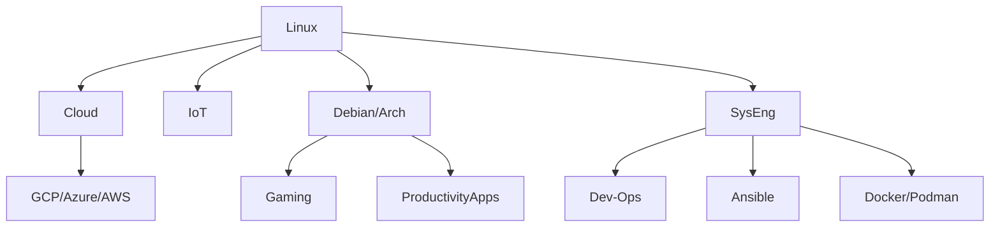
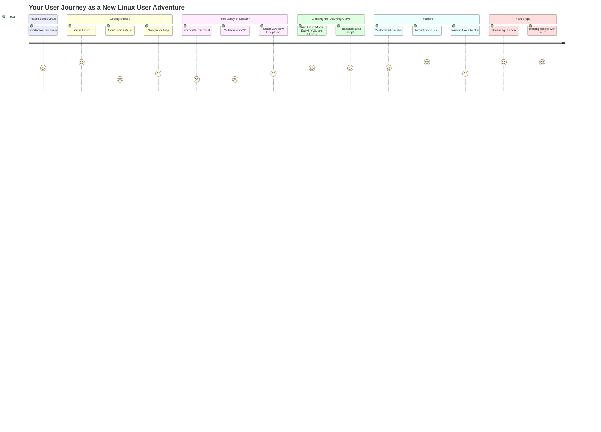

Welcome to the Docs! here you have an overview of what you can learn at **Linux Made Easy**.

<!-- This is a demo of the theme's documentation layout.

## Hello, World!

```go {filename="main.go"}
package main

import "fmt"

func main() {
    fmt.Println("Hello, World!")
}
``` -->




This is what you can expect in **the Linux journey**:

